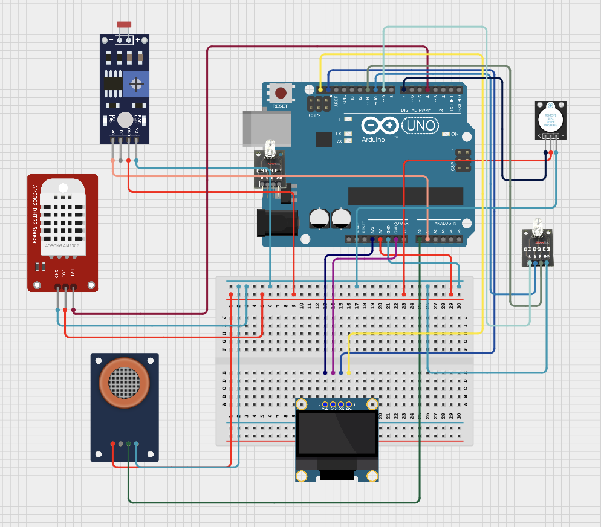

# My Little Environment

An IoT project on the Arduino UNO R4 WiFi board. It notifies the user if a measured signal data goes out of desired range chosen by the user. It features a web dashboard server, a Telegram bot, and Google Sheets integration.

## What it does

The board reads four values every 2 seconds:

- **Temperature** (°C) — DHT22
- **Humidity** (%) — DHT22
- **Carbon dioxide** (PPM) — MQ-135, converted from the raw reading with a known formula
- **Light** (brightness) — LDR

Each reading is compared with the corresponding desired range. The RGB LED shows the result at a glance: green when OK, red when a value is out of range, blue when the room is dark. You can also enable a buzzer beep and/or a Telegram message, per reading. The alert fires once when a value first goes out of its range, rather than on every cycle.

## Circuit

| Part | Job |
|------|-----|
| Arduino UNO R4 WiFi | runs everything |
| DHT22 | temperature and humidity |
| MQ-135 gas sensor | air quality / CO₂ estimate |
| LDR (photoresistor) | light level |
| SH1106 OLED (I²C) | shows readings |
| RGB LED | status color (green / red / blue) |
| Buzzer | sound alert |

All pins are defined in `config.h`; hence, rewiring is easy.

## Connected features

- **Web dashboard** — open `http://<device-ip>` in a browser. Live values, history graphs (last hour / day / week or a custom window, with the average as a dashed line), inputs for the desired ranges, and checkboxes for buzzer/Telegram per reading. The page polls `/api` every few seconds.
- **Telegram bot** — send `/status` for the current readings, `/calibrate` to redo the fresh-air calibration of MQ135, `/help` for the command list. Alerts are automatically sent to chat.
- **Google Sheets** — readings are sent every 5 minutesviato an Apps Script web app.
- **OLED screen** — cycles between the current readings and their range status.
- **Persistent memory** — settings and history are written to EEPROM every 30 minutes and restored after a power cut.

## History

Three rolling series at different zoom levels, each in a ring buffer (the oldest sample gets overwritten, so memory use never grows):

| Series | Sample every | Covers |
|--------|--------------|--------|
| Hour | 1 minute | last hour |
| Day | 15 minutes | last day |
| Week | 2 hours | last week |

## Files

| File | Role |
|------|------|
| `my_little_environment.ino` | setup and the main loop |
| `config.h` | pins, WiFi, tokens, constants |
| `monitor.h` | shared structs and function declarations |
| `sensors.cpp` | sensor reading, CO₂ calibration |
| `alerts.cpp` | range checks, LED, buzzer, notifications |
| `display.cpp` | OLED drawing |
| `history.cpp` | clock, rolling history, EEPROM |
| `network.cpp` | WiFi, Telegram, Google Sheets |
| `webserver.cpp` | web server and JSON API |
| `dashboard.cpp` | the dashboard page itself |

## Reproducibility

1. Install the *Arduino UNO R4 Boards* package, plus the *DHT sensor library* (with *Adafruit Unified Sensor*) and *U8g2*.
2. Open `my_little_environment.ino` in the Arduino IDE.
3. Edit `config.h`: enter your WiFi name and password. Optionally add your Telegram bot token, chat id, and Google Sheets webapp link.
4. Select *Arduino UNO R4 WiFi* and press **Upload**.
5. Open the Serial Monitor at **115200** baud. After connecting, the board prints `Dashboard: http://192.168.x.x`.

On first boot the device warms up for 180 seconds and calibrates the gas sensor After a restart with saved state, the warm-up shrinks to 20 seconds.

### Telegram and Sheets setup

- **Telegram:** instantiate a bot, put its token and your chat id.
- **Google Sheets:** make a sheet, open *Extensions/Apps Script*, write a short script that reads the URL parameters and appends a row, deploy it as a web app, and copy the `/exec` link into `SHEETS_PATH`.

by Burak Can Arikan
